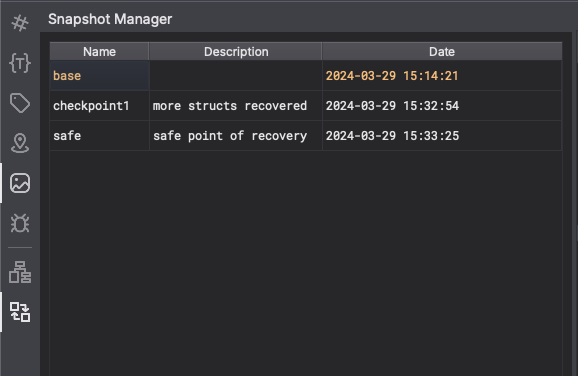
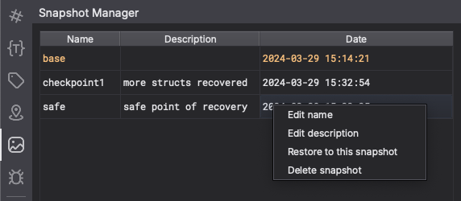

# Snapshot Manager (v0.1)

Author: **d0minik**

_Binary Ninja plugin to manage database snapshots_

## Description:

A UI plugin to take, restore & manage database snapshots of your BNDBs, just like VM snapshots!

## Features

- Take snapshots of BNDB state
- Restore any previous state
- Delete unused states

## Installation

`git clone` this repo into your Binary Ninja plugins directory.

## Minimum Version

This plugin requires the following minimum version of Binary Ninja:

* 4911

## License

This plugin is released under a AGPL license.

## Metadata Version

2
